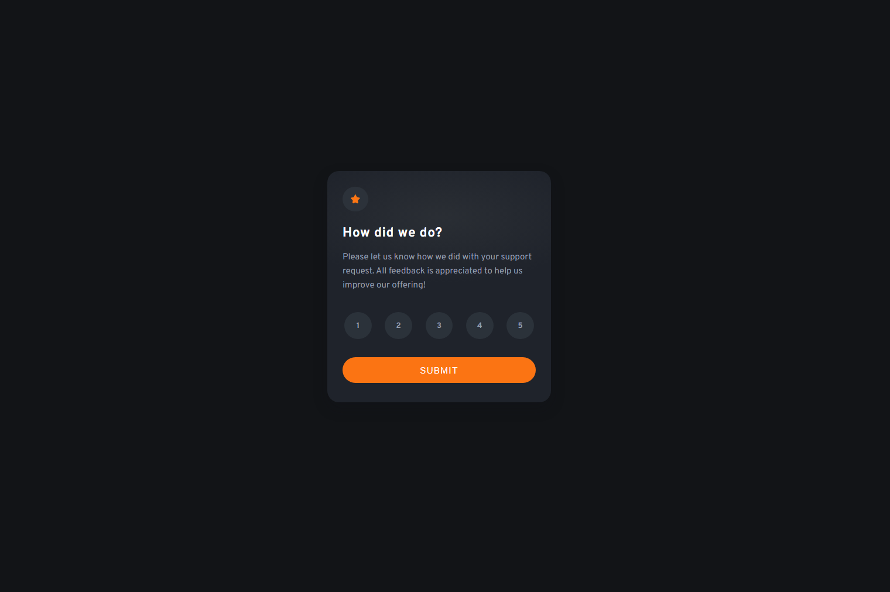

# Frontend Mentor - Interactive rating component solution

This is a solution to the [Interactive rating component challenge on Frontend Mentor](https://www.frontendmentor.io/challenges/interactive-rating-component-koxpeBUmI). Frontend Mentor challenges help you improve your coding skills by building realistic projects. 

## Table of contents

- [Overview](#overview)
  - [The challenge](#the-challenge)
  - [Screenshot](#screenshot)
  - [Links](#links)
- [My process](#my-process)
  - [Built with](#built-with)
  - [What I learned](#what-i-learned)
  - [Continued development](#continued-development)
- [Author](#author)

## Overview

### The challenge

Users should be able to:

- View the optimal layout for the app depending on their device's screen size
- See hover states for all interactive elements on the page
- Select and submit a number rating
- See the "Thank you" card state after submitting a rating

### Screenshot

### Links

https://nachtwurst.github.io/interactive-rating-component/

## My process

### Built with

- Semantic HTML5 markup
- CSS
- Flexbox
- Mobile-first workflow
- JavaScript

### What I learned

I learned how to use JavaScript alongside HTML. The syntax was difficult for me, since I've only really used Python in the past, but I managed to put something together. My CSS and HTMl are generally improving, too, though I haven't done anything too strenuous.

### Continued development

I'd like to learn more JavaScript, and its best practices.

## Author

- Frontend Mentor - [@nachtwurst](https://www.frontendmentor.io/profile/nachtwurst)
